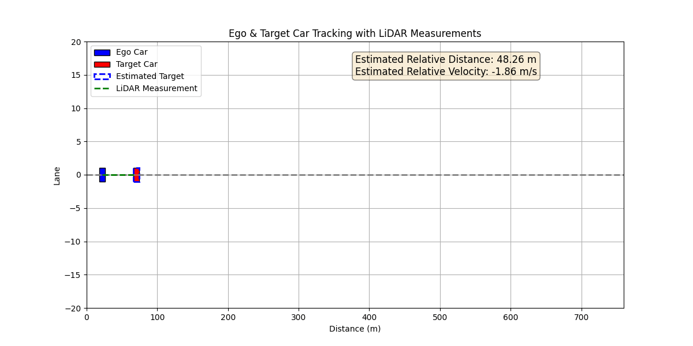

# Ego and Target Car Tracking with LiDAR Measurements Using Kalman Filter

Simulate a real-world scenario where an ego vehicle (your car) tracks a target vehicle (the car ahead) using noisy LiDAR distance measurements and a Kalman filter. The simulation visualizes the positions of both vehicles on a road and displays the estimated relative state (distance and velocity) of the target vehicle in real time.



## Overview

In this simulation:
- **Ego Vehicle:** Represents your car that moves at a constant speed.
- **Target Vehicle:** The car ahead which also moves at a constant speed (possibly different from the ego vehicle).
- **LiDAR Measurements:** The distance between the two vehicles is measured using simulated LiDAR data with added Gaussian noise.
- **Kalman Filter:** Implements a 1D Kalman filter to estimate the relative state (distance and velocity) between the target and ego vehicles based on noisy LiDAR measurements.

## Requirements

- Python 3.x
- NumPy
- Matplotlib

You can install the required packages via pip:

```bash
pip install numpy matplotlib
```

## Usage
Run the simulation by executing the Python script:

```bash
python kalman_filter.py
```